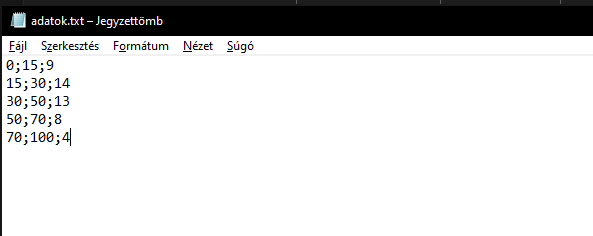

Statisztika 1.zh 3.feladat megoldó program by: TA.

[h1]Használata:[/h1]

- Nyisd meg a "Program" mappát, majd az "adatok.txt"-t.
- A kapott excel fájlban a Következő adatokat keresd meg: Bevétel alsóhatár, felsőhatár, gyakorisság

- Ezeket az értékeket pontosvesszővel (;) elválasztva illesszük be az "adatok.txt"-be, ahogy a példán látható.

- Ha ezzel megvagyunk, mentsük el, majd zárjuk be az "adatok.txt"-t.
- Inditsuk el a "statisztikazh1.exe" fájlt.
- Ekkor ez az ablak fog fogadni.

- A konzol ablakban megjelennek az eredmények, viszont létrehoz egy "result.csv"-t és egy "result.txt" fájlt is.
- A "result.csv" fájlt megnyitva excel táblázatban láthatjuk az értékeket.

- Használjátok egészséggel!